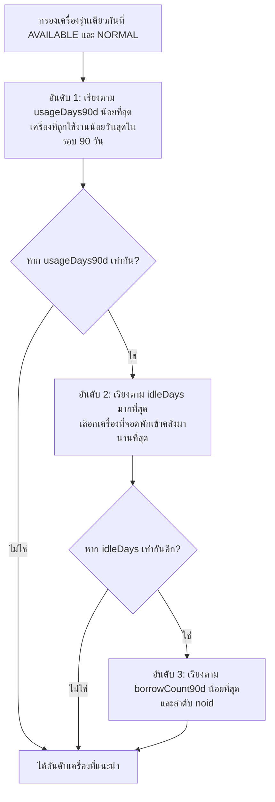

# Technical Specification: Smart Asset Borrow Recommendation Engine
# (ระบบแนะนำครุภัณฑ์ในการยืมเพื่อกระจายภาระการใช้งาน)

- **Effort:** `borrow-recommendation`
- **Created Date:** 2026-09-10
- **Status:** APPROVED & READY FOR IMPLEMENTATION
- **Target Roles:** `DEPARTMENT_STAFF` (ผู้ขอยืม Self-Service), `ASSET_CENTER_STAFF` / `PARCEL_STAFF` (เจ้าหน้าที่จ่ายของที่ศูนย์ครุภัณฑ์), `MANAGER`

---

## 1. วัตถุประสงค์และปัญหาหน้างาน (Executive Summary)

ในการใช้งานระบบยืม-คืนครุภัณฑ์ของโรงพยาบาล มักพบปัญหา **"การยืมกระจุกตัวอยู่เฉพาะเครื่องเดิมซ้ำๆ (Asset Hotspotting & Uneven Wear-and-Tear)"** เช่น แผนกมีเครื่องช่วยหายใจรุ่นเดียวกัน 3 เครื่อง แต่ผู้ใช้มักเลือกกดเครื่องแรกในรายการเสมอ หรือเจ้าหน้าที่หยิบเฉพาะเครื่องที่วางอยู่ด้านหน้าชั้นวาง ทำให้เครื่องหนึ่งทำงานหนักและเสื่อมสภาพเร็ว ขณะที่อีกสองเครื่องจอดว่าง

ระบบนี้ถูกออกแบบมาเพื่อ:
1. **กระจายภาระการใช้งานอย่างสมดุล (Balanced Wear-and-Tear Distribution):** แนะนำเครื่องที่มีวันใช้งานสะสมน้อยกว่า เพื่อหมุนเวียนอายุการใช้งานของเครื่องมือแพทย์
2. **ไม่ให้เครื่องที่เพิ่งคืนถูกหยิบซ้ำทันที (Resting / Idle Rotation):** ให้ความสำคัญกับเครื่องที่คืนเข้าคลังและจอดพักมานานกว่า
3. **ประสบการณ์ใช้งานที่ฉลาดแต่ไม่บังคับ (Smart Swap Nudge):** มีป้ายแนะนำ 🌟 ในแคตตาล็อก และมีกล่องแจ้งเตือนให้สลับเครื่องอัตโนมัติ (Swap Nudge) หากผู้ใช้กำลังจะยืมเครื่องที่มีการใช้งานหนัก

---

## 2. อัลกอริทึมหมุนเวียนการใช้งาน (Balanced Usage Rotation Algorithm)

ระบบจะพิจารณาเฉพาะเครื่องที่เป็น **รุ่นเดียวกัน (`model` เดียวกัน)** และมีสถานะพร้อมใช้งาน (`availabilityStatus = 'AVAILABLE'` และ `assetStatus = 'NORMAL'`)



### 2.1 ลำดับการจัดอันดับ (Ranking Hierarchy)
1. **`usageDays90d` (ASC):** จำนวนวันใช้งานสุทธิในรอบ 90 วันล่าสุด (ยิ่งน้อยยิ่งได้อันดับดี)
2. **`idleDays` (DESC):** จำนวนวันที่จอดพักในคลังนับจากคืนล่าสุด (`return_date`) หรือวันที่รับมอบเครื่อง (`receive_date`) สำหรับเครื่องใหม่
3. **`borrowCount90d` (ASC):** จำนวนครั้งที่ถูกยืมในรอบ 90 วัน
4. **`asset.noid` / `asset.id` (ASC):** Deterministic Tie-breaker

### 2.2 เกณฑ์การแจ้งเตือนสลับเครื่อง (Smart Swap Nudge Condition)
หากผู้ใช้เลือกเครื่อง $A$ ระบบจะส่ง Flag `hasBetterAlternative = true` พร้อมเครื่อง $B$ เมื่อ:
- `assetB.usageDays90d <= assetA.usageDays90d - 3` (เครื่อง B ถูกใช้งานน้อยกว่าอย่างน้อย 3 วันขึ้นไป) **หรือ**
- `assetA.usageDays90d >= 7` AND `assetB.idleDays >= assetA.idleDays + 7` (เครื่อง A เพิ่งถูกคืนมาไม่นาน ขณะที่เครื่อง B จอดพักมานานกว่าเกิน 1 สัปดาห์)

### 2.3 ข้อความเหตุผลภาษาไทย (Explainable Thai Messages)
- **เครื่องที่แนะนำอันดับ 1:**
  - *"🌟 แนะนำเครื่องนี้: ผ่านการใช้งานเพียง X วันในรอบ 90 วัน และจอดพักมาแล้ว Y วัน เหมาะสำหรับการหมุนเวียนใช้งาน"*
  - เครื่องใหม่: *"🌟 แนะนำเครื่องนี้: ครุภัณฑ์ใหม่พร้อมใช้งาน ยังไม่มีประวัติการยืมในรอบ 90 วัน"*
- **ข้อความแจ้งเตือนสลับเครื่อง:**
  - *"💡 พบเครื่องรุ่นเดียวกัน (หมายเลข [noid]) จอดพักมาแล้ว [Y] วัน (ผ่านการใช้งานน้อยกว่าเครื่องนี้ [Z] วัน) คุณต้องการสลับใช้เครื่องที่แนะนำเพื่อกระจายการใช้งานหรือไม่?"*

---

## 3. สถาปัตยกรรมการสืบค้นข้อมูล (PostgreSQL CTE Query)

ดึงข้อมูลทั้งหมดในคำสั่งเดียวผ่าน `prisma.$queryRaw` (Zero N+1):

```sql
WITH candidate_assets AS (
  SELECT 
    a.asset_id,
    a.noid,
    a.name,
    a.model,
    a.serial_no,
    a.receive_date,
    a.image_url,
    s.name AS section_name
  FROM asset a
  JOIN asset_status ast ON ast.asset_status_id = a.asset_status_id
  JOIN availability_status avs ON avs.availability_status_id = a.availability_status_id
  LEFT JOIN section s ON s.section_id = a.section_id
  WHERE a.model = $1
    AND ast.code = 'NORMAL'
    AND avs.code = 'AVAILABLE'
),
borrow_metrics_90d AS (
  SELECT 
    bt.asset_id,
    COUNT(bt.borrow_transaction_id) AS borrow_count_90d,
    MAX(bt.return_date) AS last_return_date,
    COALESCE(SUM(
      GREATEST(0, EXTRACT(EPOCH FROM (
        LEAST(COALESCE(bt.return_date, NOW()), NOW()) - 
        GREATEST(COALESCE(bt.handover_date, bt.created_at), NOW() - INTERVAL '90 days')
      )) / 86400.0)
    ), 0) AS usage_days_90d
  FROM borrow_transaction bt
  JOIN candidate_assets ca ON ca.asset_id = bt.asset_id
  WHERE (bt.return_date >= NOW() - INTERVAL '90 days' 
     OR bt.handover_date >= NOW() - INTERVAL '90 days'
     OR bt.created_at >= NOW() - INTERVAL '90 days')
  GROUP BY bt.asset_id
)
SELECT 
  ca.*,
  COALESCE(bm.usage_days_90d, 0) AS usage_days_90d,
  COALESCE(bm.borrow_count_90d, 0) AS borrow_count_90d,
  bm.last_return_date,
  GREATEST(0, EXTRACT(EPOCH FROM (
    NOW() - COALESCE(bm.last_return_date, ca.receive_date, NOW())
  )) / 86400.0) AS idle_days
FROM candidate_assets ca
LEFT JOIN borrow_metrics_90d bm ON bm.asset_id = ca.asset_id
ORDER BY 
  usage_days_90d ASC,
  idle_days DESC,
  borrow_count_90d ASC,
  ca.noid ASC;
```

---

## 4. สัญญา API (API Contracts)

### 4.1 `GET /borrowings/recommendations`
- **Query:** `model?: string`, `equipmentTypeId?: number`
- **Response:**
  ```json
  {
    "model": "Puritan Bennett 840",
    "totalAvailable": 3,
    "recommendedAssetId": "uuid-asset-3",
    "candidates": [
      {
        "assetId": "uuid-asset-3",
        "noid": "MD-67-003",
        "name": "เครื่องช่วยหายใจชนิดควบคุมด้วยปริมาตรและความดัน",
        "model": "Puritan Bennett 840",
        "serialNo": "SN-PB840-003",
        "sectionName": "ศูนย์เครื่องมือแพทย์",
        "usageDays90d": 0.0,
        "idleDays": 45.2,
        "borrowCount90d": 0,
        "isRecommended": true,
        "recommendationReason": "🌟 แนะนำเครื่องนี้: ครุภัณฑ์ใหม่พร้อมใช้งาน ยังไม่มีประวัติการยืมในรอบ 90 วัน"
      }
    ]
  }
  ```

### 4.2 `GET /borrowings/recommendations/swap-check`
- **Query:** `assetId: string`
- **Response:**
  ```json
  {
    "selectedAsset": { "id": "uuid-asset-1", "noid": "MD-67-001", "usageDays90d": 26.0, "idleDays": 1.5 },
    "hasBetterAlternative": true,
    "recommendedAsset": {
      "id": "uuid-asset-3",
      "noid": "MD-67-003",
      "name": "เครื่องช่วยหายใจชนิดควบคุมด้วยปริมาตรและความดัน",
      "model": "Puritan Bennett 840",
      "usageDays90d": 0.0,
      "idleDays": 45.2,
      "daysUsageDifference": 26.0,
      "nudgeReason": "💡 พบเครื่องรุ่นเดียวกัน (หมายเลข MD-67-003) จอดพักมาแล้ว 45 วัน (ผ่านการใช้งานน้อยกว่าเครื่องนี้ 26 วัน) คุณต้องการสลับใช้เครื่องที่แนะนำเพื่อกระจายการใช้งานหรือไม่?"
    }
  }
  ```

---

## 5. พิมพ์เขียวฝั่งหน้าบ้านและการจัดการ Concurrency (Frontend Blueprint)

### 5.1 โค้ดตัวอย่าง React (Smart Swap Alert Banner)
```tsx
{swapData?.hasBetterAlternative && (
  <div className="p-3 bg-amber-50 border border-amber-300 rounded-md my-3 flex items-center justify-between">
    <div className="text-amber-800 text-sm">
      {swapData.recommendedAsset.nudgeReason}
    </div>
    <button
      type="button"
      className="ml-3 px-3 py-1 bg-amber-600 text-white rounded text-sm hover:bg-amber-700"
      onClick={() => setSelectedAssetId(swapData.recommendedAsset.id)}
    >
      สลับใช้เครื่องนี้
    </button>
  </div>
)}
```

### 5.2 Concurrency Handling (HTTP 409 Fallback)
- ระบบมี `prisma.$transaction` คุ้มครองอยู่ใน `createBorrow` หากเครื่องถูกชิงยืมไปก่อน จะส่งกลับ `HTTP 409 Conflict`
- หน้าบ้านแสดง Toast: *"เครื่องนี้เพิ่งถูกยืมไป ระบบกำลังเลือกเครื่องว่างลำดับถัดไปให้คุณ"* และดึงเครื่องสำรองขึ้นมาให้ทันที

---

## 6. แผนการพัฒนา Backend (Implementation Architecture)

ต่อเติมเข้ากับโมดูลเดิม `src/asset-borrow/`:
1. `src/asset-borrow/dto/query-borrow-recommendations.dto.ts` (ใหม่)
2. `src/asset-borrow/dto/check-swap.dto.ts` (ใหม่)
3. `src/asset-borrow/asset-borrow.service.ts`:
   - เพิ่ม `getBorrowRecommendations(query: QueryBorrowRecommendationsDto)`
   - เพิ่ม `checkSwapRecommendation(assetId: string)`
4. `src/asset-borrow/asset-borrow.controller.ts`:
   - เพิ่ม `GET /borrowings/recommendations`
   - เพิ่ม `GET /borrowings/recommendations/swap-check`
5. `src/asset-borrow/asset-borrow.service.spec.ts`: Unit Tests สำหรับ Rotation Ranking
