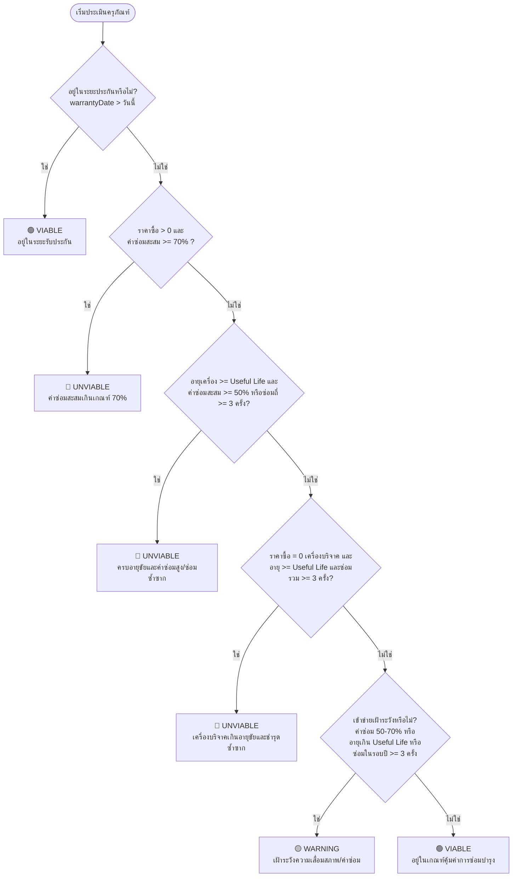

# Technical Specification: Asset Repair Economic Viability
# (ระบบวิเคราะห์ความคุ้มค่าในการซ่อมและเกณฑ์แทงจำหน่ายครุภัณฑ์รายเครื่อง)

- **Effort:** `repair-viability`
- **Created Date:** 2026-09-10
- **Status:** APPROVED & READY FOR IMPLEMENTATION
- **Target Role:** `PARCEL_STAFF` (เจ้าหน้าที่พัสดุ), `MAINTENANCE_HEAD` (หัวหน้างานซ่อมบำรุง), `ADMIN`
- **Regulatory Reference:** วิธีปฏิบัติงานการแทงจำหน่ายเครื่องมือแพทย์ โรงพยาบาลบางสะพาน (รหัสเอกสาร EQM-WI-040)

---

## 1. วัตถุประสงค์และขอบเขต (Executive Summary)

ระบบประเมินความคุ้มค่าในการซ่อมบำรุงครุภัณฑ์รายเครื่อง ออกแบบมาเพื่อเป็นเครื่องมือช่วยตัดสินใจ (Decision Support System) สำหรับเจ้าหน้าที่พัสดุ (`PARCEL_STAFF`) ในการ:
1. **คัดกรองและประเมินก่อนส่งซ่อม:** พิจารณาว่าควรอนุมัติให้ช่างซ่อมต่อ หรือชะลอเพื่อพิจารณาความคุ้มค่า
2. **การสำรวจสภาพพัสดุประจำปี:** คัดกรองรายชื่อครุภัณฑ์ที่มีความเสี่ยงสูง (High Cost Ratio / Useful Life Expired / High Breakdown Frequency) เพื่อรวบรวมเสนอคณะกรรมการสอบหาข้อเท็จจริง/คณะกรรมการจำหน่ายพัสดุ
3. **เชื่อมต่อสู่กระบวนการแทงจำหน่าย:** มีกลไกส่งต่อข้อมูลเข้าสู่ระบบจำหน่ายครุภัณฑ์ (`/disposals`) หรือปรับสถานะเป็น `WAIT_DISPOSAL` ได้ทันที

---

## 2. ตรรกะการประเมิน Rule-based Decision Tree (Algorithm Logic)

การประเมินความคุ้มค่าใช้หลักการ **Rule-based Decision Tree** เพื่อให้ได้ผลลัพธ์ที่มีเหตุผลโปร่งใส ตรวจสอบย้อนกลับได้ตามระเบียบพัสดุภาครัฐ โดยเรียงลำดับความสำคัญ (Precedence Order) 6 ขั้นตอน:



### 2.1 นิยามตัวแปรและการคำนวณ
- **ราคาจัดซื้อเดิม (`price`):** ดึงจาก `Asset.price`
- **อายุการใช้งานจริง (`ageYears`):** `(NOW() - Asset.receive_date) ในหน่วยปี` (ทศนิยม 1 ตำแหน่ง)
- **อายุการใช้งานมาตรฐาน (`usefulLifeYears`):** ดึงจาก `AssetType.useful_life` (หาก $\le 0$ หรือ null ให้ใช้ค่า Fallback มาตรฐานที่ **8 ปี**)
- **ต้นทุนค่าซ่อมสะสม (`cumulativeRepairCost`):**
  $$\text{Cumulative Cost} = \sum (\text{RepairJob.repairCost}) + \sum (\text{WITHDRAW parts}) - \sum (\text{RETURN parts})$$
- **อัตราส่วนค่าซ่อมสะสมต่อราคาเครื่อง (`costRatioPercentage`):**
  $$\text{Cost Ratio} = \left( \frac{\text{cumulativeRepairCost}}{\text{price}} \right) \times 100$$
  *(หาก `price <= 0` ให้เป็น `null`)*
- **ความถี่ในการส่งซ่อมรอบปี (`recentRepairCount`):** จำนวน RepairJob ที่สร้างในรอบ 365 วันล่าสุด

### 2.2 ข้อความเหตุผลภาษาไทย (Explainable Reason Messages)
- **🔴 UNVIABLE:**
  - *"ค่าซ่อมสะสม (฿X,XXX) คิดเป็น XX.X% ของราคาจัดซื้อ ซึ่งเกินเกณฑ์ร้อยละ 70 ตามระเบียบพัสดุ"*
  - *"ครุภัณฑ์ใช้งานมาแล้ว X.X ปี (เกินอายุขัยมาตรฐาน X ปี) และมีค่าซ่อมสะสมเกินร้อยละ 50 หรือส่งซ่อมซ้ำซาก"*
  - *"ครุภัณฑ์ไม่มีราคาจัดซื้อ (บริจาค/โอนย้าย) ใช้งานเกินอายุขัยมาตรฐาน (X.X ปี) และมีประวัติส่งซ่อมซ้ำซากเกินเกณฑ์"*
- **🟡 WARNING:**
  - *"ค่าซ่อมสะสมคิดเป็น XX.X% ของราคาจัดซื้อ (เข้าข่ายเฝ้าระวังช่วง 50–70%)"*
  - *"ครุภัณฑ์ใช้งานมาแล้ว X.X ปี ซึ่งครบอายุขัยมาตรฐาน (X ปี) ควรเฝ้าระวังความคุ้มค่าในการซ่อมครั้งต่อไป"*
  - *"ส่งซ่อมถี่ผิดปกติ (X ครั้งในรอบ 12 เดือนล่าสุด)"*
- **🟢 VIABLE:**
  - *"ค่าซ่อมสะสมและอายุการใช้งานอยู่ในเกณฑ์คุ้มค่าต่อการซ่อมบำรุง"*
  - *"ครุภัณฑ์ยังอยู่ในระยะรับประกันการใช้งาน (สิ้นสุดวันที่ DD/MM/YYYY)"*

---

## 3. สถาปัตยกรรมการสืบค้นข้อมูล (Database Query Architecture)

ใช้ **Hybrid Architecture** เพื่อความเร็วระดับ Enterprise และ Zero N+1:

### 3.1 การสืบค้นตารางรวม (`GET /assets/viability`)
ใช้ **PostgreSQL CTE ผ่าน `prisma.$queryRaw`**:
```sql
WITH repair_cost_per_job AS (
  SELECT 
    rj.job_id,
    rj.asset_id,
    rj.repair_cost,
    rj.created_at,
    COALESCE(SUM(
      CASE 
        WHEN st.txn_type = 'WITHDRAW' THEN st.qty * st.unit_price
        WHEN st.txn_type = 'RETURN' THEN - (st.qty * st.unit_price)
        ELSE 0 
      END
    ), 0) AS parts_cost
  FROM repair_job rj
  LEFT JOIN sparepart_txns st ON st.job_id = rj.job_id
  GROUP BY rj.job_id, rj.asset_id, rj.repair_cost, rj.created_at
),
asset_repair_summary AS (
  SELECT 
    asset_id,
    COUNT(job_id) AS total_repair_count,
    COUNT(CASE WHEN created_at >= NOW() - INTERVAL '1 year' THEN 1 END) AS recent_repair_count,
    COALESCE(SUM(COALESCE(repair_cost, 0) + parts_cost), 0) AS cumulative_repair_cost
  FROM repair_cost_per_job
  GROUP BY asset_id
)
SELECT 
  a.asset_id,
  a.noid,
  a.name,
  a.model,
  a.serial_no,
  a.price,
  a.receive_date,
  a.warranty_date,
  t.name AS asset_type_name,
  COALESCE(t.useful_life, 8) AS useful_life_years,
  s.name AS section_name,
  ast.code AS asset_status_code,
  ast.name AS asset_status_name,
  avs.code AS availability_status_code,
  COALESCE(ars.total_repair_count, 0) AS total_repair_count,
  COALESCE(ars.recent_repair_count, 0) AS recent_repair_count,
  COALESCE(ars.cumulative_repair_cost, 0) AS cumulative_repair_cost
FROM asset a
LEFT JOIN asset_repair_summary ars ON ars.asset_id = a.asset_id
LEFT JOIN asset_type t ON t.asset_type_id = a.type_id
LEFT JOIN section s ON s.section_id = a.section_id
LEFT JOIN asset_status ast ON ast.asset_status_id = a.asset_status_id
LEFT JOIN availability_status avs ON avs.availability_status_id = a.availability_status_id
WHERE ast.code NOT IN ('DISPOSAL', 'LOST');
```

### 3.2 การสืบค้นเจาะลึกรายเครื่อง (`GET /assets/:id/viability`)
ใช้ **Prisma Client `findUnique`** ร่วมกับ Relation Loading:
- `include: { type: true, section: true, status: true, availabilityStatus: true, repairJobs: { include: { sparepartTxns: { include: { sparepart: true } } } } }`
- รวบรวมข้อมูลรายการงานซ่อมและอะไหล่ทั้งหมด ส่งออกเป็น JSON แบบ Itemized รายการ

---

## 4. สัญญา API (API Contracts)

### 4.1 `GET /assets/viability`
- **Query DTO:**
  ```typescript
  export class QueryAssetViabilityDto {
    page?: number = 1;
    limit?: number = 20;
    viabilityStatus?: 'ALL' | 'VIABLE' | 'WARNING' | 'UNVIABLE';
    sectionId?: string;
    assetTypeId?: number;
    search?: string;
    sortBy?: 'costRatio' | 'cumulativeCost' | 'repairCount' | 'age' | 'createdAt' = 'costRatio';
    sortOrder?: 'asc' | 'desc' = 'desc';
    includeDisposed?: boolean = false;
  }
  ```
- **Response Format:**
  - `summary`: กล่อง KPI Counters (`totalEvaluated`, `viableCount`, `warningCount`, `unviableCount`, `totalCumulativeRepairCost`)
  - `items`: อาร์เรย์ของรายการครุภัณฑ์พร้อม metrics และ `viabilityStatus`
  - `pagination`: ข้อมูลแบ่งหน้ามาตรฐาน (`total`, `page`, `limit`, `totalPages`, `hasNext`, `hasPrev`)

### 4.2 `GET /assets/:id/viability`
- คืนค่าข้อมูลครุภัณฑ์, ผลประเมินและตัวชี้วัดทางการเงิน, ประวัติงานซ่อมบำรุงย้อนหลัง (`repairHistory`), และข้อเสนอแนะในการแทงจำหน่าย (`disposalRecommendation`)

---

## 5. การเชื่อมต่อกับระบบแทงจำหน่าย (Disposal Flow Integration)

1. **Pre-disposal Guard:**
   - หาก `availabilityStatus === 'BORROWED'` $\rightarrow$ ล็อกปุ่มจำหน่าย พร้อมแสดงข้อความเตือนให้รับคืนก่อน
   - หากมีงานซ่อมค้างอยู่ $\rightarrow$ มีลิงก์ให้ดำเนินการปิด Job ด้วยแทร็ก `UNREPAIRABLE`
2. **Pre-filled Handshake:**
   - ส่งก้อน `prefillData` เพื่อเปิด Modal หรือพาไปยังหน้า `/disposals` โดยไม่ต้องกรอกข้อมูลซ้ำ:
     - `assetId`, `noid`, `name`, `price`, `cumulativeRepairCost`, `costRatioPercentage`, `suggestedDisposalReason`
3. **Execution Endpoint:**
   - ใช้งานร่วมกับ `POST /asset/:id/disposal` ที่มีอยู่ในระบบแล้ว

---

## 6. โครงสร้างไฟล์ใน Backend (Module File Structure)

สร้างโมดูลเฉพาะ `src/asset-viability/` แยกออกจากโมดูลหลักเพื่อความเป็นอิสระและทดสอบง่าย:
```
src/asset-viability/
├── asset-viability.module.ts
├── asset-viability.controller.ts
├── asset-viability.service.ts
├── dto/
│   ├── query-asset-viability.dto.ts
│   └── asset-viability-response.dto.ts
└── asset-viability.service.spec.ts
```

---

## 7. แผนการตรวจสอบและทดสอบ (Verification & Testing Plan)

1. **Unit Tests (`asset-viability.service.spec.ts`):**
   - ทดสอบ Decision Tree ครอบคลุม 8 Test Scenarios (ปกติ, มีประกัน, ค่าซ่อมเกิน 70%, ครบอายุขัยและค่าซ่อม $\ge 50\%$, เครื่องบริจาคราคา 0 บาท, ซ่อมซ้ำซาก)
2. **Integration / e2e Test:**
   - ทดสอบการ Query จริงกับ PostgreSQL CTE ผ่าน Seed Data
   - ตรวจสอบความถูกต้องของสถิติใน `summary` KPI Box
