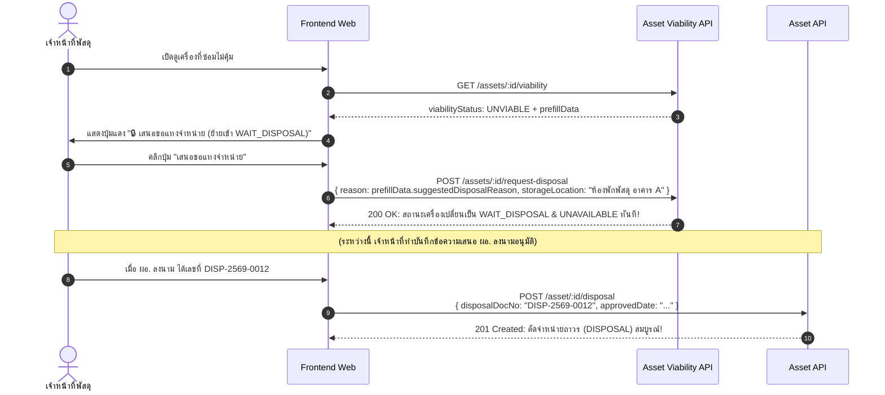

# 📘 คู่มือการใช้งาน API: Asset Repair Economic Viability Module
# (ระบบประเมินความคุ้มค่าในการซ่อมและเสนอแทงจำหน่ายครุภัณฑ์)

เอกสารแนะนำการใช้งาน API เส้นทางการประเมินความคุ้มค่าของเครื่องมือแพทย์และครุภัณฑ์ ตามระเบียบพัสดุและวิธีปฏิบัติการแทงจำหน่ายเครื่องมือแพทย์ (**EQM-WI-040**) สำหรับนักพัฒนาหน้าบ้าน (Frontend), ผู้ดูแลระบบ (Admin) และเจ้าหน้าที่พัสดุ (Parcel Staff)

---

## 🧭 1. ภาพรวมของ API ทั้ง 4 เส้นทาง (The 4 Endpoints Explained)

ใน Swagger / Scalar API Reference จะเห็น API ทั้งหมด **4 เส้นทาง (4 Endpoints)** ซึ่งแบ่งออกเป็น **2 หน้าที่หลัก** และมี **เส้นทางหลัก (Standard RESTful)** คู่กับ **เส้นทางสำรอง (Alias)** เพื่อให้หน้าบ้านเรียกใช้ได้สะดวกและไม่มีปัญหาเรื่อง URL ดังนี้ครับ:

| เส้นที่ | Method | Endpoint Path | หมวดหมู่ | วัตถุประสงค์และการใช้งานบนหน้าจอ |
| :---: | :---: | :--- | :---: | :--- |
| **1** | **`GET`** | `/assets/viability` | **หน้ารวม (หลัก)** | **หน้ารวม Audit ภาพรวมทั้งโรงพยาบาล (พหูพจน์):** ดึงสถิติ KPI การเงิน, สรุปจำนวนเครื่องคุ้มค่า/ไม่คุ้มค่า, และตารางรายการครุภัณฑ์ทั้งหมด รองรับการแบ่งหน้า ค้นหา และกรอง |
| **2** | **`GET`** | `/asset/viability` | **หน้ารวม (Alias)** | **หน้ารวมแบบเอกพจน์ (Alias สำหรับ Frontend):** ทำงานและให้ผลลัพธ์เหมือนเส้นที่ 1 ทุกประการ รองรับหน้าบ้านที่ใช้ Base Path เอกพจน์ เช่น `/asset/...` |
| **3** | **`GET`** | `/assets/:id/viability` | **เจาะลึก (หลัก)** | **หน้าเจาะลึกรายเครื่อง (พหูพจน์):** ดูผลวิเคราะห์ความคุ้มค่าเจาะจงเครื่องนั้นๆ ตรวจประวัติงานซ่อมและมูลค่าอะไหล่ทุก Job ในอดีต พร้อมเตรียมข้อมูลสำหรับกด **"เสนอแทงจำหน่าย"** (`prefillData`) |
| **4** | **`GET`** | `/asset/:id/viability` | **เจาะลึก (Alias)** | **หน้าเจาะลึกแบบเอกพจน์ (Alias สำหรับ Frontend):** ทำงานและให้ผลลัพธ์เหมือนเส้นที่ 3 ทุกประการ รองรับหน้าบ้านที่ใช้ Base Path เอกพจน์ เช่น `/asset/:id` |
| **5** | **`POST`** | `/assets/:id/request-disposal`<br>*(Alias: `/asset/:id/request-disposal`)* | **Action กักเครื่อง (Case C)** | **กดเสนอขอแทงจำหน่าย (ปรับเป็น `WAIT_DISPOSAL`):** เปลี่ยนสถานะเครื่องเป็น "รอจำหน่าย", ล็อกห้ามยืม (`UNAVAILABLE`) ทันที และบันทึกเหตุผลผลประเมินลง Audit Remark |

> 💡 **ทำไมต้องมีทั้ง `assets` และ `asset`?**
> * ตามมาตรฐาน RESTful ทั่วไป การดึงข้อมูลเป็น Collection มักใช้พหูพจน์ (`/assets/...`)
> * แต่ในระบบ Frontend บางหน้าที่พัฒนามาก่อนหน้า ได้ใช้ Base Path เป็นเอกพจน์ (`/asset/...`)
> * Backend จึงเปิดรองรับไว้ทั้ง 2 รูปแบบ เพื่อให้ **ไม่ว่าจะเรียกด้วยพหูพจน์หรือเอกพจน์ ก็ทำงานได้ผลลัพธ์เหมือนกัน 100%** หน้าบ้านไม่ต้องกังวลเรื่องการตั้งชื่อ Path

---

### 🔍 เจาะลึกรายละเอียดของแต่ละเส้นทาง

#### 📌 เส้นที่ 1: `GET /assets/viability` (หน้ารวม Audit ทั้งโรงพยาบาล - พหูพจน์)
* **ใช้สำหรับ:** หน้า Dashboard ภาพรวม, ตาราง Audit ตรวจสอบครุภัณฑ์ประจำปีของพัสดุและผู้บริหาร
* **สิ่งที่ส่งไป (Query Parameters):**
  - `page`: หน้าที่ต้องการ (ค่าตั้งต้น: 1)
  - `limit`: จำนวนแถวต่อหน้า (ค่าตั้งต้น: 20)
  - `viabilityStatus`: กรองตามสถานะ (`ALL`, `VIABLE`, `WARNING`, `UNVIABLE`)
  - `sectionId`: กรองเฉพาะแผนก (UUID เช่น แผนก ICU)
  - `assetTypeId`: กรองเฉพาะประเภทครุภัณฑ์ (ID เช่น เครื่องมือแพทย์)
  - `search`: ค้นหาชื่อเครื่อง, รหัส `noid`, รุ่น `model`, หรือ Serial Number
  - `sortBy`: จัดเรียงตาม `costRatio` (% ค่าซ่อม), `cumulativeCost` (ยอดเงินค่าซ่อม), `repairCount` (จำนวนครั้งซ่อม), `age` (อายุเครื่อง)
  - `sortOrder`: ทิศทาง `desc` หรือ `asc`
  - `includeDisposed`: รวมเครื่องที่เคยแทงจำหน่ายแล้วหรือไม่ (`true`/`false`)
* **สิ่งที่ได้กลับมา (Response):**
  - ก้อน `summary`: ตัวเลข KPI รวม (จำนวนเครื่องที่คุ้มค่า, จำนวนเครื่องที่ควรแทงจำหน่าย, ยอดค่าซ่อมสะสมรวมทั้งโรงพยาบาล)
  - ก้อน `items`: รายการครุภัณฑ์ในหน้านั้นๆ พร้อม `viabilityStatus`, `viabilityReason`, และตัวเลขการเงิน
  - ก้อน `pagination`: ข้อมูลการแบ่งหน้า (`total`, `totalPages`, `hasNext`, `hasPrev`)

#### 📌 เส้นที่ 2: `GET /asset/viability` (หน้ารวม Audit ทั้งโรงพยาบาล - เอกพจน์)
* **ใช้สำหรับ:** ฟังก์ชันเดียวกับเส้นที่ 1 ทุกประการ
* **จุดประสงค์:** เป็น Alias สำรองให้หน้าบ้านที่ชอบเรียก URL เอกพจน์ (`/asset/viability`) ใช้งานได้ทันทีโดยไม่ต้องเปลี่ยนเป็น `assets`

#### 📌 เส้นที่ 3: `GET /assets/:id/viability` (หน้าวิเคราะห์เจาะลึกรายเครื่อง - พหูพจน์)
* **ใช้สำหรับ:** แสดงใน Modal/หน้ารายละเอียดของครุภัณฑ์รายเครื่อง, ตรวจสอบความคุ้มค่าในขั้นตอนอนุมัติงบซ่อม (Step 5 ของระบบซ่อม), และใช้กดเสนอแทงจำหน่าย
* **สิ่งที่ส่งไป (Path Parameter):**
  - `:id`: UUID ของครุภัณฑ์ที่ต้องการตรวจสอบ เช่น `/assets/8f74e951-692a-43d9-95e5-3f32d8471bd8/viability`
* **สิ่งที่ได้กลับมา (Response):**
  - `asset`: ข้อมูลทั่วไปของครุภัณฑ์ (ชื่อ, รหัส, แผนก, ราคาซื้อ, วันที่รับมอบ, ประกัน)
  - `viability`: ผลประเมินเชิงลึก สัดส่วน % ค่าซ่อม, อายุเครื่องเทียบกับ Useful Life, และเหตุผลประกอบตามระเบียบพัสดุ
  - `repairHistory`: ประวัติงานซ่อมทั้งหมดในอดีต แจกแจงละเอียดถึงค่าจ้างซ่อมภายนอก (`outsourceCost`) และรายการอะไหล่ที่เคยเบิกใช้ (`spareParts`)
  - `disposalRecommendation`: ข้อเสนอแนะเชิงนโยบาย:
    - `canInitiateDisposal`: `true` ถ้าเข้าเกณฑ์แทงจำหน่าย
    - `prefillData`: ก้อนข้อมูลสำเร็จรูป (ชื่อ, ราคา, ค่าซ่อม, เหตุผลการแทงจำหน่าย, เลขเอกสารแนะนำ) พร้อมส่งต่อเข้าฟอร์มแทงจำหน่ายแบบ 1-Click

#### 📌 เส้นที่ 4: `GET /asset/:id/viability` (หน้าวิเคราะห์เจาะลึกรายเครื่อง - เอกพจน์)
* **ใช้สำหรับ:** ฟังก์ชันเดียวกับเส้นที่ 3 ทุกประการ
* **จุดประสงค์:** เป็น Alias สำรองให้หน้าบ้านที่เรียก URL รูปแบบเอกพจน์ (`/asset/:id/viability`) ใช้งานได้ทันที 100%

---

## 🏷️ 2. ความหมายของแต่ละสถานะ (Viability Status Definition)

ระบบจะคำนวณและส่งคืนสถานะ `viabilityStatus` ออกมาเป็น 3 ระดับ เพื่อให้หน้าบ้านนำไปแสดง Badge สีและป้ายเตือน:

```
┌───────────────────────────┐      ┌───────────────────────────┐      ┌───────────────────────────┐
│         🟢 VIABLE         │      │        🟡 WARNING         │      │        🔴 UNVIABLE        │
│      คุ้มค่าในการซ่อม      │ ───▶ │   เฝ้าระวัง / ใกล้เกินเกณฑ์ │ ───▶ │  ไม่คุ้มค่า / ควรแทงจำหน่าย │
└───────────────────────────┘      └───────────────────────────┘      └───────────────────────────┘
```

### 🟢 1. `VIABLE` (คุ้มค่าในการซ่อม)
* **ความหมาย:** ครุภัณฑ์มีสภาพสมบูรณ์ ค่าใช้จ่ายในการซ่อมบำรุงยังอยู่ในเกณฑ์ที่คุ้มค่าที่จะซ่อมแซมเพื่อใช้งานต่อไป
* **เกณฑ์ที่เข้าสถานะนี้:**
  - เครื่องยังอยู่ในระยะรับประกัน (`isWarrantyActive: true`) **หรือ**
  - ค่าซ่อมสะสมยังไม่เกิน 50% ของราคาจัดซื้อ และยังไม่เกินอายุขัยการใช้งาน
* **สิ่งที่หน้าบ้านควรแสดง:**
  - Badge สีเขียว: `คุ้มค่าในการซ่อม`
  - ปุ่ม Action: ดำเนินการซ่อมตามปกติ (`PROCEED_REPAIR`)
  - ปุ่มแทงจำหน่าย: ปิดการใช้งาน (Disabled) พร้อมเหตุผลว่าเครื่องยังคุ้มค่าในการซ่อม

### 🟡 2. `WARNING` (เฝ้าระวัง / ใกล้เกินเกณฑ์)
* **ความหมาย:** เครื่องเริ่มมีสัญญาณความเสี่ยงทางการเงินหรือการชำรุด ควรให้พัสดุและช่างพิจารณาอย่างรอบคอบก่อนอนุมัติงบซ่อมครั้งถัดไป
* **เกณฑ์ที่เข้าสถานะนี้ (ข้อใดข้อหนึ่ง):**
  - สัดส่วนค่าซ่อมสะสมแตะระดับ **50.0% – 69.9%** ของราคาจัดซื้อ
  - อายุเครื่องเกินอายุการใช้งานมาตรฐาน (Useful Life เช่น เกิน 5-8 ปี) แม้ค่าซ่อมยังไม่สูง
  - ส่งซ่อมถี่ตั้งแต่ **3 ครั้งขึ้นไปในรอบ 12 เดือนล่าสุด** (ซ่อมซ้ำซาก)
* **สิ่งที่หน้าบ้านควรแสดง:**
  - Badge สีส้ม/เหลือง: `เฝ้าระวัง / ใกล้เกินเกณฑ์`
  - ป้ายเตือน (Alert Box): แสดงข้อความแนะนำให้ประเมินราคาอะไหล่เทียบกับความคุ้มค่าก่อนซ่อม (`CAUTION_REPAIR`)

### 🔴 3. `UNVIABLE` (ไม่คุ้มค่าในการซ่อม / เสนอแทงจำหน่าย)
* **ความหมาย:** ตามระเบียบพัสดุและแนวปฏิบัติ EQM-WI-040 การซ่อมแซมต่อไปถือว่าสิ้นเปลืองงบประมาณ ไม่คุ้มค่าทางเศรษฐศาสตร์ สมควรเสนอขออนุมัติแทงจำหน่าย (Disposal) และจัดหาเครื่องทดแทน
* **เกณฑ์ที่เข้าสถานะนี้ (เข้าเงื่อนไขใดเงื่อนไขหนึ่งตาม Decision Tree):**
  1. **สัดส่วนค่าซ่อมวิกฤต:** ค่าซ่อมสะสม $\ge 70.0\%$ ของราคาจัดซื้อ
  2. **หมดอายุขัย + ค่าซ่อมสูง/ซ่อมซาก:** อายุเครื่องเกิน Useful Life **และ** (ค่าซ่อมสะสม $\ge 50.0\%$ **หรือ** ส่งซ่อมสะสม $\ge 3$ ครั้ง)
  3. **เครื่องราคา 0 บาท (รับบริจาค/โอนย้าย):** อายุเกิน Useful Life และมีประวัติส่งซ่อมสะสม $\ge 3$ ครั้ง
* **สิ่งที่หน้าบ้านควรแสดง:**
  - Badge สีแดง: `ไม่คุ้มค่า / ควรแทงจำหน่าย`
  - ปุ่ม Action: **"🗑️ เสนอพิจารณาแทงจำหน่าย"** (`canInitiateDisposal: true`)
  - เมื่อผู้ใช้คลิกปุ่ม จะดึงก้อน `prefillData` ส่งไปเปิดหน้าแบบฟอร์มแทงจำหน่ายได้ทันที 1-Click

---

## 🌳 3. ตรรกะการประเมิน 6 ขั้นตอน (Rule-based Decision Tree)

ระบบประเมินข้อมูลเครื่องผ่าน Pure Function ตามลำดับความสำคัญ (Top-down) ดังนี้:


---

## 💻 4. รายละเอียดการเรียกใช้และการประยุกต์ใช้งานจริง (Use Cases)

### Use Case A: หน้า Dashboard & ตาราง Audit ภาพรวม
ใช้ Endpoint: `GET /assets/viability`

#### Parameter ในการค้นหาและกรอง (Query Parameters)
* `page`: หน้าที่ต้องการ (default: 1)
* `limit`: จำนวนแถวต่อหน้า (default: 20, max: 100)
* `viabilityStatus`: กรองสถานะ (`ALL`, `VIABLE`, `WARNING`, `UNVIABLE`)
* `sectionId`: UUID ของแผนก (เช่น กรองดูเฉพาะเครื่องใน ICU)
* `assetTypeId`: ID ของประเภทครุภัณฑ์ (เช่น กรองดูเฉพาะเครื่องมือแพทย์)
* `search`: ค้นหาข้อความ (ค้นหาจาก ชื่อเครื่อง, รุ่น `model`, เลขครุภัณฑ์ `noid`, หรือ Serial No)
* `sortBy`: ฟิลด์ที่ใช้จัดเรียง:
  - `costRatio` (เรียงตาม % สัดส่วนค่าซ่อม - ค่าตั้งต้น)
  - `cumulativeCost` (เรียงตามยอดเงินค่าซ่อมสะสม)
  - `repairCount` (เรียงตามจำนวนครั้งที่ซ่อม)
  - `age` (เรียงตามอายุเครื่อง)
  - `createdAt` (เรียงตามวันที่สร้าง)
* `sortOrder`: `desc` หรือ `asc`
* `includeDisposed`: `true` หรือ `false` (default: `false` ซ่อนเครื่องที่แทงจำหน่ายแล้ว)

#### ตัวอย่างการเรียก (Request):
```http
GET /assets/viability?viabilityStatus=UNVIABLE&sortBy=costRatio&sortOrder=desc&page=1&limit=10
Authorization: Bearer <TOKEN>
```

#### การนำข้อมูล Response ไปจัดวางบนหน้าจอ UI:
1. **ก้อน `summary`** ➔ นำไปแสดงกล่องสถิติ KPI การเงินด้านบนตาราง:
   - `totalEvaluated`: จำนวนเครื่องที่ตรวจทั้งหมด
   - `viableCount`: จำนวนเครื่องที่ยังคุ้มค่า (สีเขียว)
   - `warningCount`: จำนวนเครื่องเฝ้าระวัง (สีส้ม)
   - `unviableCount`: จำนวนเครื่องที่ควรแทงจำหน่าย (สีแดง)
   - `totalCumulativeRepairCost`: ยอดค่าซ่อมรวมทั้งสิ้นของโรงพยาบาล (บาท)
2. **ก้อน `items`** ➔ นำไปเรนเดอร์ในแต่ละแถวของตาราง:
   - แสดงคอลัมน์: รหัสครุภัณฑ์, ชื่อ, แผนก, อายุเครื่อง, ค่าซ่อมสะสม, สัดส่วน % ค่าซ่อม, และ Badge สถานะ
   - มีปุ่ม "ดูรายละเอียด" เพื่อเปิดหน้า Single Deep-dive

---

### Use Case B: ตรวจสอบความคุ้มค่าก่อนอนุมัติใบแจ้งซ่อม (Maintenance Approval Step)
เมื่อมีใบแจ้งซ่อมเข้ามาในระบบ (เช่น ในหน้าช่างวินิจฉัย หรือหน้าพัสดุอนุมัติงบ Step 5):
* หน้าบ้านยิง `GET /assets/:id/viability` โดยส่ง `asset_id` ของเครื่องที่กำลังจะซ่อม
* **ถ้าผลลัพธ์เป็น `UNVIABLE`**:
  - หน้าบ้านจะแสดงป้ายเตือนตัวโตสีแดง: *"⚠️ เครื่องนี้มีค่าซ่อมสะสมเกินเกณฑ์ความคุ้มค่าแล้ว (XX%) ตามระเบียบพัสดุ EQM-WI-040 แนะนำให้เสนอแทงจำหน่ายแทนการส่งซ่อม"*
  - ช่วยให้เจ้าหน้าที่พัสดุและผู้บริหารไม่เผลออนุมัติงบซ่อมเครื่องที่ไม่คุ้มค่า

---

### Use Case C: การเชื่อมต่อเสนอแทงจำหน่าย (Disposal Handover Flow)
เมื่อระบบตรวจพบว่าเครื่องมีสถานะ `UNVIABLE` (ซ่อมไม่คุ้มค่าแล้ว):
ใน Response ของ `GET /assets/:id/viability` จะมีก้อน `disposalRecommendation.prefillData` เตรียมไว้ให้:

```json
{
  "canInitiateDisposal": true,
  "prefillData": {
    "assetId": "8f74e951-692a-43d9-95e5-3f32d8471bd8",
    "noid": "MD-60-0012",
    "name": "เครื่องช่วยหายใจชนิดควบคุมด้วยปริมาตรและความดัน",
    "price": 450000.0,
    "cumulativeRepairCost": 337500.0,
    "costRatioPercentage": 75.0,
    "suggestedDisposalReason": "แทงจำหน่ายเนื่องจากประเมินแล้วซ่อมไม่คุ้มค่า: ค่าซ่อมสะสม (฿337,500.00) คิดเป็น 75.0% ของราคาจัดซื้อ ซึ่งเกินเกณฑ์ร้อยละ 70 ตามระเบียบพัสดุ",
    "suggestedDocPrefix": "DISP-2569-"
  }
}
```

#### 🔗 ลำดับการเรียกใช้ API ของ Use Case C (Step-by-Step API Pairing):



1. **ขั้นที่ 1 (กักเครื่อง & ล็อกห้ามยืม):**
   - หน้าบ้านยิง **`POST /assets/:id/request-disposal`**
   - ส่ง `{ reason: prefillData.suggestedDisposalReason, storageLocation: "..." }`
   - **ผลลัพธ์:** เครื่องจะเปลี่ยนสถานะเป็น **`WAIT_DISPOSAL` (รอจำหน่าย)** และ **`UNAVAILABLE`** ทันที ไม่ต้องจำ ID เลข 4 และบันทึกเหตุผลผลประเมินลงประวัติเครื่องให้อัตโนมัติ
2. **ขั้นที่ 2 (ตัดจำหน่ายถาวรเมื่อเอกสารอนุมัติ):**
   - เมื่อได้เลขที่หนังสืออนุมัติจริงจากผู้อำนวยการ ค่อยยิง **`POST /asset/:id/disposal`** พร้อมเลขที่ `disposalDocNo` เพื่อปิดวงจรชีวิตครุภัณฑ์เป็น **`DISPOSAL`**

---

## 📋 5. ตัวอย่าง Code ฝั่ง Frontend (React / TypeScript Snippet)

```tsx
import React, { useEffect, useState } from 'react';

interface ViabilityDetail {
  viability: {
    status: 'VIABLE' | 'WARNING' | 'UNVIABLE';
    reason: string;
    costRatioPercentage: number | null;
  };
  disposalRecommendation: {
    canInitiateDisposal: boolean;
    prefillData: {
      assetId: string;
      noid: string | null;
      suggestedDisposalReason: string;
    };
  };
}

export function AssetViabilityWidget({ assetId }: { assetId: string }) {
  const [data, setData] = useState<ViabilityDetail | null>(null);
  const [loading, setLoading] = useState(false);

  useEffect(() => {
    fetch(`/assets/${assetId}/viability`, {
      headers: { Authorization: `Bearer ${localStorage.getItem('token')}` },
    })
      .then((res) => res.json())
      .then((resData) => setData(resData));
  }, [assetId]);

  // ฟังก์ชันสำหรับ Use Case C: กดย้ายเข้าสู่สถานะ WAIT_DISPOSAL ทันที 1-Click
  const handleRequestDisposal = async () => {
    if (!data?.disposalRecommendation.prefillData) return;
    const confirm = window.confirm('ยืนยันเสนอขอแทงจำหน่ายและล็อกเครื่องเข้าสู่สถานะ WAIT_DISPOSAL หรือไม่?');
    if (!confirm) return;

    setLoading(true);
    try {
      const response = await fetch(`/assets/${assetId}/request-disposal`, {
        method: 'POST',
        headers: {
          'Content-Type': 'application/json',
          Authorization: `Bearer ${localStorage.getItem('token')}`,
        },
        body: JSON.stringify({
          reason: data.disposalRecommendation.prefillData.suggestedDisposalReason,
          storageLocation: 'ห้องพักพัสดุรอจำหน่าย อาคาร A',
        }),
      });

      if (response.ok) {
        alert('✅ ปรับสถานะเป็น WAIT_DISPOSAL (รอจำหน่าย) และล็อกห้ามยืมเรียบร้อยแล้ว!');
        window.location.reload();
      } else {
        const err = await response.json();
        alert(`❌ ไม่สามารถดำเนินการได้: ${err.message}`);
      }
    } finally {
      setLoading(false);
    }
  };

  if (!data) return <div>กำลังโหลดการวิเคราะห์ความคุ้มค่า...</div>;

  const { viability, disposalRecommendation } = data;

  const badgeColors = {
    VIABLE: 'bg-green-100 text-green-800 border-green-300',
    WARNING: 'bg-amber-100 text-amber-800 border-amber-300',
    UNVIABLE: 'bg-red-100 text-red-800 border-red-300',
  };

  return (
    <div className="p-4 bg-white rounded-lg shadow border border-gray-200">
      <div className="flex items-center justify-between mb-2">
        <h3 className="font-semibold text-gray-800">ผลการประเมินความคุ้มค่าในการซ่อม</h3>
        <span className={`px-2.5 py-1 text-xs font-bold rounded-full border ${badgeColors[viability.status]}`}>
          {viability.status}
        </span>
      </div>

      <p className="text-sm text-gray-600 mb-3">{viability.reason}</p>

      {/* แถบสัดส่วนค่าซ่อมสะสม */}
      <div className="mb-4">
        <div className="flex justify-between text-xs text-gray-500 mb-1">
          <span>สัดส่วนค่าซ่อมสะสม</span>
          <span className="font-semibold">{viability.costRatioPercentage?.toFixed(1) || 0}%</span>
        </div>
        <div className="w-full bg-gray-200 h-2 rounded-full overflow-hidden">
          <div
            className={`h-full ${
              (viability.costRatioPercentage || 0) >= 70
                ? 'bg-red-500'
                : (viability.costRatioPercentage || 0) >= 50
                ? 'bg-amber-500'
                : 'bg-green-500'
            }`}
            style={{ width: `${Math.min(100, viability.costRatioPercentage || 0)}%` }}
          />
        </div>
      </div>

      {/* ปุ่มกดเสนอแทงจำหน่ายสำหรับ Use Case C */}
      {disposalRecommendation.canInitiateDisposal && (
        <button
          onClick={handleRequestDisposal}
          disabled={loading}
          className="w-full py-2 px-4 bg-red-600 hover:bg-red-700 text-white text-sm font-medium rounded transition disabled:opacity-50"
        >
          {loading ? 'กำลังบันทึก...' : '🔒 เสนอขอแทงจำหน่าย (ปรับเป็น WAIT_DISPOSAL)'}
        </button>
      )}
    </div>
  );
}
```

---

## 📌 6. สรุป Cheat Sheet สำหรับผู้พัฒนา

* **Audit รวมทั้งโรงพยาบาล:** ใช้ `GET /assets/viability`
* **ดูเจาะจงรายเครื่อง + ประวัติอะไหล่:** ใช้ `GET /assets/:id/viability`
* **กักเครื่องไม่คุ้มซ่อม (Case C ขั้นแรก):** ใช้ `POST /assets/:id/request-disposal` ➔ ปรับเป็น `WAIT_DISPOSAL` & `UNAVAILABLE`
* **ตัดจำหน่ายถาวรเมื่อมีเลขหนังสืออนุมัติ (Case C ขั้นสุดท้าย):** ใช้ `POST /asset/:id/disposal` ➔ ปรับเป็น `DISPOSAL`
* **Interactive Test:** ทดสอบลองยิง API ผ่านหน้าเว็บ Swagger ได้ที่ `http://localhost:3000/reference` ภายใต้หัวข้อ `Asset Viability`
