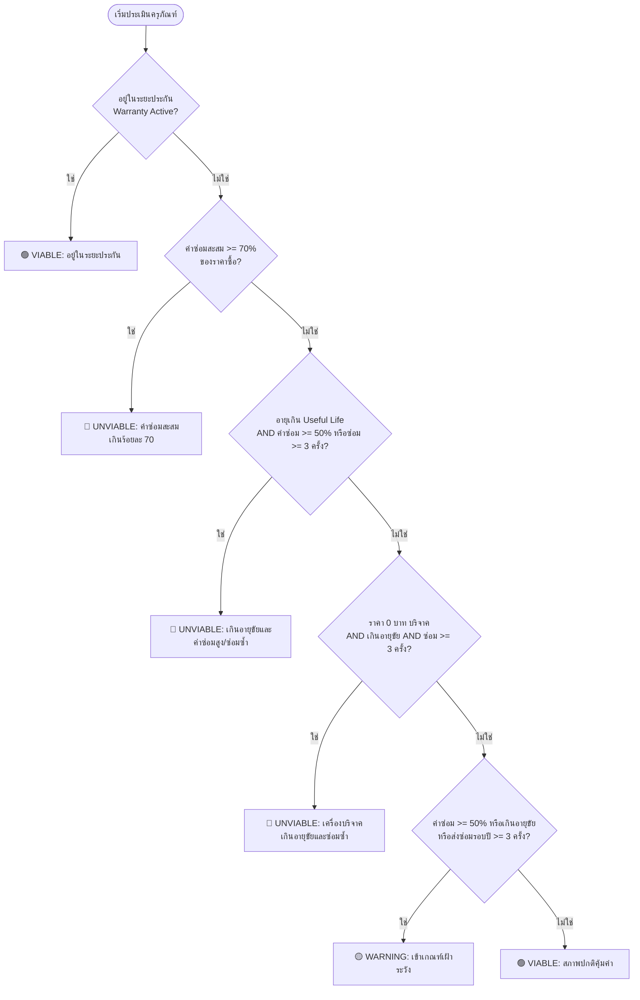

# 📘 คู่มือการใช้งาน API: Asset Repair Economic Viability Module
# (ระบบประเมินความคุ้มค่าในการซ่อมและเสนอแทงจำหน่ายครุภัณฑ์)

เอกสารแนะนำการใช้งาน API เส้นทางการประเมินความคุ้มค่าของเครื่องมือแพทย์และครุภัณฑ์ ตามระเบียบพัสดุและวิธีปฏิบัติการแทงจำหน่ายเครื่องมือแพทย์ (**EQM-WI-040**) สำหรับนักพัฒนาหน้าบ้าน (Frontend), ผู้ดูแลระบบ (Admin) และเจ้าหน้าที่พัสดุ (Parcel Staff)

---

## 🧭 1. ภาพรวมของ API (API Overview)

ระบบประเมินความคุ้มค่าในการซ่อมประกอบด้วย **2 เส้นทางหลัก** โดยเปิดให้อนุญาตใช้งานสำหรับ Role:
- `PARCEL_STAFF` (เจ้าหน้าที่พัสดุ)
- `MAINTENANCE_HEAD` (หัวหน้าศูนย์ซ่อม/งานช่าง)
- `ADMIN` (ผู้ดูแลระบบ)
- `MANAGER` (ผู้บริหาร)

| Method | Endpoint Path | วัตถุประสงค์หลัก | การใช้งานบนหน้าจอ |
| :---: | :--- | :--- | :--- |
| **`GET`** | `/assets/viability`<br>*(Alias: `/asset/viability`)* | **หน้ารวม Audit & Dashboard**<br>ดึงรายการครุภัณฑ์ทั้งหมด พร้อมการจัดอันดับความคุ้มค่า, ตัวเลข KPI ภาพรวม, และรองรับการค้นหา/กรอง | ใช้แสดงตาราง Audit ตรวจสอบครุภัณฑ์ทั้งโรงพยาบาล, หน้าจอ Dashboard ติดตามเครื่องที่เสี่ยงไม่คุ้มค่า |
| **`GET`** | `/assets/:id/viability`<br>*(Alias: `/asset/:id/viability`)* | **หน้าเจาะลึกรายเครื่อง (Single Deep-dive)**<br>ดูผลวิเคราะห์เจาะจงเครื่อง, ประวัติงานซ่อมและมูลค่าอะไหล่ทุก Job, และข้อมูลเตรียมพร้อมสำหรับกด **"เสนอแทงจำหน่าย"** | ใช้แสดงใน Modal หรือหน้ารายละเอียดครุภัณฑ์, และผูกกับปุ่ม "ดำเนินการแทงจำหน่าย" เพื่อส่งต่อไปยังโมดูล Disposal |

---

## 🏷️ 2. ความหมายของแต่ละสถานะ (Viability Status Definition)

ระบบจะคำนวณและส่งคืนสถานะ `viabilityStatus` ออกมาเป็น 3 ระดับ เพื่อให้หน้าบ้านนำไปแสดง Badge สีและป้ายเตือน:

```
┌───────────────────────────┐      ┌───────────────────────────┐      ┌───────────────────────────┐
│         🟢 VIABLE         │      │        🟡 WARNING         │      │        🔴 UNVIABLE        │
│      คุ้มค่าในการซ่อม      │ ───▶ │   เฝ้าระวัง / ใกล้เกินเกณฑ์ │ ───▶ │  ไม่คุ้มค่า / ควรแทงจำหน่าย │
└───────────────────────────┘      └───────────────────────────┘      └───────────────────────────┘
```

### 🟢 1. `VIABLE` (คุ้มค่าในการซ่อม)
* **ความหมาย:** ครุภัณฑ์มีสภาพสมบูรณ์ ค่าใช้จ่ายในการซ่อมบำรุงยังอยู่ในเกณฑ์ที่คุ้มค่าที่จะซ่อมแซมเพื่อใช้งานต่อไป
* **เกณฑ์ที่เข้าสถานะนี้:**
  - เครื่องยังอยู่ในระยะรับประกัน (`isWarrantyActive: true`) **หรือ**
  - ค่าซ่อมสะสมยังไม่เกิน 50% ของราคาจัดซื้อ และยังไม่เกินอายุขัยการใช้งาน
* **สิ่งที่หน้าบ้านควรแสดง:**
  - Badge สีเขียว: `คุ้มค่าในการซ่อม`
  - ปุ่ม Action: ดำเนินการซ่อมตามปกติ (`PROCEED_REPAIR`)
  - ปุ่มแทงจำหน่าย: ปิดการใช้งาน (Disabled) พร้อมเหตุผลว่าเครื่องยังคุ้มค่าในการซ่อม

### 🟡 2. `WARNING` (เฝ้าระวัง / ใกล้เกินเกณฑ์)
* **ความหมาย:** เครื่องเริ่มมีสัญญาณความเสี่ยงทางการเงินหรือการชำรุด ควรให้พัสดุและช่างพิจารณาอย่างรอบคอบก่อนอนุมัติงบซ่อมครั้งถัดไป
* **เกณฑ์ที่เข้าสถานะนี้ (ข้อใดข้อหนึ่ง):**
  - สัดส่วนค่าซ่อมสะสมแตะระดับ **50.0% – 69.9%** ของราคาจัดซื้อ
  - อายุเครื่องเกินอายุการใช้งานมาตรฐาน (Useful Life เช่น เกิน 5-8 ปี) แม้ค่าซ่อมยังไม่สูง
  - ส่งซ่อมถี่ตั้งแต่ **3 ครั้งขึ้นไปในรอบ 12 เดือนล่าสุด** (ซ่อมซ้ำซาก)
* **สิ่งที่หน้าบ้านควรแสดง:**
  - Badge สีส้ม/เหลือง: `เฝ้าระวัง / ใกล้เกินเกณฑ์`
  - ป้ายเตือน (Alert Box): แสดงข้อความแนะนำให้ประเมินราคาอะไหล่เทียบกับความคุ้มค่าก่อนซ่อม (`CAUTION_REPAIR`)

### 🔴 3. `UNVIABLE` (ไม่คุ้มค่าในการซ่อม / เสนอแทงจำหน่าย)
* **ความหมาย:** ตามระเบียบพัสดุและแนวปฏิบัติ EQM-WI-040 การซ่อมแซมต่อไปถือว่าสิ้นเปลืองงบประมาณ ไม่คุ้มค่าทางเศรษฐศาสตร์ สมควรเสนอขออนุมัติแทงจำหน่าย (Disposal) และจัดหาเครื่องทดแทน
* **เกณฑ์ที่เข้าสถานะนี้ (เข้าเงื่อนไขใดเงื่อนไขหนึ่งตาม Decision Tree):**
  1. **สัดส่วนค่าซ่อมวิกฤต:** ค่าซ่อมสะสม $\ge 70.0\%$ ของราคาจัดซื้อ
  2. **หมดอายุขัย + ค่าซ่อมสูง/ซ่อมซาก:** อายุเครื่องเกิน Useful Life **และ** (ค่าซ่อมสะสม $\ge 50.0\%$ **หรือ** ส่งซ่อมสะสม $\ge 3$ ครั้ง)
  3. **เครื่องราคา 0 บาท (รับบริจาค/โอนย้าย):** อายุเกิน Useful Life และมีประวัติส่งซ่อมสะสม $\ge 3$ ครั้ง
* **สิ่งที่หน้าบ้านควรแสดง:**
  - Badge สีแดง: `ไม่คุ้มค่า / ควรแทงจำหน่าย`
  - ปุ่ม Action: **"🗑️ เสนอพิจารณาแทงจำหน่าย"** (`canInitiateDisposal: true`)
  - เมื่อผู้ใช้คลิกปุ่ม จะดึงก้อน `prefillData` ส่งไปเปิดหน้าแบบฟอร์มแทงจำหน่ายได้ทันที 1-Click

---

## 🌳 3. ตรรกะการประเมิน 6 ขั้นตอน (Rule-based Decision Tree)

ระบบประเมินข้อมูลเครื่องผ่าน Pure Function ตามลำดับความสำคัญ (Top-down) ดังนี้:



---

## 💻 4. รายละเอียดการเรียกใช้และการประยุกต์ใช้งานจริง (Use Cases)

### Use Case A: หน้า Dashboard & ตาราง Audit ภาพรวม
ใช้ Endpoint: `GET /assets/viability`

#### Parameter ในการค้นหาและกรอง (Query Parameters)
* `page`: หน้าที่ต้องการ (default: 1)
* `limit`: จำนวนแถวต่อหน้า (default: 20, max: 100)
* `viabilityStatus`: กรองสถานะ (`ALL`, `VIABLE`, `WARNING`, `UNVIABLE`)
* `sectionId`: UUID ของแผนก (เช่น กรองดูเฉพาะเครื่องใน ICU)
* `assetTypeId`: ID ของประเภทครุภัณฑ์ (เช่น กรองดูเฉพาะเครื่องมือแพทย์)
* `search`: ค้นหาข้อความ (ค้นหาจาก ชื่อเครื่อง, รุ่น `model`, เลขครุภัณฑ์ `noid`, หรือ Serial No)
* `sortBy`: ฟิลด์ที่ใช้จัดเรียง:
  - `costRatio` (เรียงตาม % สัดส่วนค่าซ่อม - ค่าตั้งต้น)
  - `cumulativeCost` (เรียงตามยอดเงินค่าซ่อมสะสม)
  - `repairCount` (เรียงตามจำนวนครั้งที่ซ่อม)
  - `age` (เรียงตามอายุเครื่อง)
  - `createdAt` (เรียงตามวันที่สร้าง)
* `sortOrder`: `desc` หรือ `asc`
* `includeDisposed`: `true` หรือ `false` (default: `false` ซ่อนเครื่องที่แทงจำหน่ายแล้ว)

#### ตัวอย่างการเรียก (Request):
```http
GET /assets/viability?viabilityStatus=UNVIABLE&sortBy=costRatio&sortOrder=desc&page=1&limit=10
Authorization: Bearer <TOKEN>
```

#### การนำข้อมูล Response ไปจัดวางบนหน้าจอ UI:
1. **ก้อน `summary`** ➔ นำไปแสดงกล่องสถิติ KPI การเงินด้านบนตาราง:
   - `totalEvaluated`: จำนวนเครื่องที่ตรวจทั้งหมด
   - `viableCount`: จำนวนเครื่องที่ยังคุ้มค่า (สีเขียว)
   - `warningCount`: จำนวนเครื่องเฝ้าระวัง (สีส้ม)
   - `unviableCount`: จำนวนเครื่องที่ควรแทงจำหน่าย (สีแดง)
   - `totalCumulativeRepairCost`: ยอดค่าซ่อมรวมทั้งสิ้นของโรงพยาบาล (บาท)
2. **ก้อน `items`** ➔ นำไปเรนเดอร์ในแต่ละแถวของตาราง:
   - แสดงคอลัมน์: รหัสครุภัณฑ์, ชื่อ, แผนก, อายุเครื่อง, ค่าซ่อมสะสม, สัดส่วน % ค่าซ่อม, และ Badge สถานะ
   - มีปุ่ม "ดูรายละเอียด" เพื่อเปิดหน้า Single Deep-dive

---

### Use Case B: ตรวจสอบความคุ้มค่าก่อนอนุมัติใบแจ้งซ่อม (Maintenance Approval Step)
เมื่อมีใบแจ้งซ่อมเข้ามาในระบบ (เช่น ในหน้าช่างวินิจฉัย หรือหน้าพัสดุอนุมัติงบ Step 5):
* หน้าบ้านยิง `GET /assets/:id/viability` โดยส่ง `asset_id` ของเครื่องที่กำลังจะซ่อม
* **ถ้าผลลัพธ์เป็น `UNVIABLE`**:
  - หน้าบ้านจะแสดงป้ายเตือนตัวโตสีแดง: *"⚠️ เครื่องนี้มีค่าซ่อมสะสมเกินเกณฑ์ความคุ้มค่าแล้ว (XX%) ตามระเบียบพัสดุ EQM-WI-040 แนะนำให้เสนอแทงจำหน่ายแทนการส่งซ่อม"*
  - ช่วยให้เจ้าหน้าที่พัสดุและผู้บริหารไม่เผลออนุมัติงบซ่อมเครื่องที่ไม่คุ้มค่า

---

### Use Case C: การเชื่อมต่อ 1-Click เสนอแทงจำหน่าย (Disposal Prefill Handover)
เมื่อเจ้าหน้าที่พัสดุตัดสินใจแทงจำหน่ายเครื่องที่ `UNVIABLE`:
ใน Response ของ `GET /assets/:id/viability` จะมีก้อน `disposalRecommendation.prefillData`:

```json
{
  "canInitiateDisposal": true,
  "prefillData": {
    "assetId": "uuid-asset-1",
    "noid": "MD-60-0012",
    "name": "เครื่องช่วยหายใจชนิดควบคุมด้วยปริมาตรและความดัน",
    "price": 450000.0,
    "cumulativeRepairCost": 337500.0,
    "costRatioPercentage": 75.0,
    "suggestedDisposalReason": "แทงจำหน่ายเนื่องจากประเมินแล้วซ่อมไม่คุ้มค่า: ค่าซ่อมสะสม (฿337,500.00) คิดเป็น 75.0% ของราคาจัดซื้อ ซึ่งเกินเกณฑ์ร้อยละ 70 ตามระเบียบพัสดุ",
    "suggestedDocPrefix": "DISP-2569-"
  }
}
```

**สิ่งที่หน้าบ้านทำ:**
ผู้ใช้กดปุ่ม **"เสนอแทงจำหน่าย"** ➔ หน้าบ้านนำก้อน `prefillData` ส่งผ่าน Router State ไปยังหน้าเปิดคำร้องขอแทงจำหน่าย (`/disposals/new`) โดยระบบจะกรอกข้อมูล รหัสเครื่อง, เหตุผลประกอบการแทงจำหน่าย, และข้อมูลตัวเลขทางพัสดุให้อัตโนมัติ โดยเจ้าหน้าที่ไม่ต้องพิมพ์เองแม้แต่คำเดียว

---

## 📋 5. ตัวอย่าง Code ฝั่ง Frontend (React / TypeScript Snippet)

```tsx
import React, { useEffect, useState } from 'react';
import { useNavigate } from 'react-router-dom';

interface ViabilityDetail {
  viability: {
    status: 'VIABLE' | 'WARNING' | 'UNVIABLE';
    reason: string;
    costRatioPercentage: number | null;
    financials: {
      originalPrice: number;
      cumulativeRepairCost: number;
    };
  };
  disposalRecommendation: {
    canInitiateDisposal: boolean;
    prefillData: any;
  };
}

export function AssetViabilityWidget({ assetId }: { assetId: string }) {
  const [data, setData] = useState<ViabilityDetail | null>(null);
  const navigate = useNavigate();

  useEffect(() => {
    fetch(`/assets/${assetId}/viability`, {
      headers: { Authorization: `Bearer ${localStorage.getItem('token')}` },
    })
      .then((res) => res.json())
      .then((resData) => setData(resData));
  }, [assetId]);

  if (!data) return <div>กำลังโหลดการวิเคราะห์ความคุ้มค่า...</div>;

  const { viability, disposalRecommendation } = data;

  // 1. กำหนดรูปแบบ Badge ตามสถานะ
  const badgeColors = {
    VIABLE: 'bg-green-100 text-green-800 border-green-300',
    WARNING: 'bg-amber-100 text-amber-800 border-amber-300',
    UNVIABLE: 'bg-red-100 text-red-800 border-red-300',
  };

  return (
    <div className="p-4 bg-white rounded-lg shadow border border-gray-200">
      <div className="flex items-center justify-between mb-2">
        <h3 className="font-semibold text-gray-800">ผลการประเมินความคุ้มค่าในการซ่อม</h3>
        <span className={`px-2.5 py-1 text-xs font-bold rounded-full border ${badgeColors[viability.status]}`}>
          {viability.status}
        </span>
      </div>

      <p className="text-sm text-gray-600 mb-3">{viability.reason}</p>

      {/* แถบเปอร์เซ็นต์ค่าซ่อมสะสม */}
      <div className="mb-4">
        <div className="flex justify-between text-xs text-gray-500 mb-1">
          <span>สัดส่วนค่าซ่อมสะสม</span>
          <span className="font-semibold">{viability.costRatioPercentage?.toFixed(1) || 0}%</span>
        </div>
        <div className="w-full bg-gray-200 h-2 rounded-full overflow-hidden">
          <div
            className={`h-full ${
              (viability.costRatioPercentage || 0) >= 70
                ? 'bg-red-500'
                : (viability.costRatioPercentage || 0) >= 50
                ? 'bg-amber-500'
                : 'bg-green-500'
            }`}
            style={{ width: `${Math.min(100, viability.costRatioPercentage || 0)}%` }}
          />
        </div>
      </div>

      {/* ปุ่มกดเสนอแทงจำหน่ายแบบ 1-Click */}
      {disposalRecommendation.canInitiateDisposal && (
        <button
          onClick={() => navigate('/disposals/new', { state: { prefill: disposalRecommendation.prefillData } })}
          className="w-full py-2 px-4 bg-red-600 hover:bg-red-700 text-white text-sm font-medium rounded transition"
        >
          🗑️ ดำเนินการเสนอแทงจำหน่าย (1-Click Disposal)
        </button>
      )}
    </div>
  );
}
```

---

## 📌 6. สรุป Cheat Sheet สำหรับผู้พัฒนา

* **Audit รวมทั้งโรงพยาบาล:** ใช้ `GET /assets/viability`
* **ดูเจาะจงรายเครื่อง + ประวัติอะไหล่:** ใช้ `GET /assets/:id/viability`
* **เช็กว่าคุ้มซ่อมไหม:** ดูที่ `viabilityStatus` (`VIABLE` = ซ่อมได้, `WARNING` = ชะลอตรวจสอบ, `UNVIABLE` = ห้ามซ่อม)
* **ส่งแทงจำหน่าย:** นำ `disposalRecommendation.prefillData` ไปวางในฟอร์มแทงจำหน่ายได้ทันที
* **Interactive Test:** ทดสอบลองยิง API ผ่านหน้าเว็บ Swagger ได้ที่ `http://localhost:3000/reference` ภายใต้หัวข้อ `Asset Viability`
