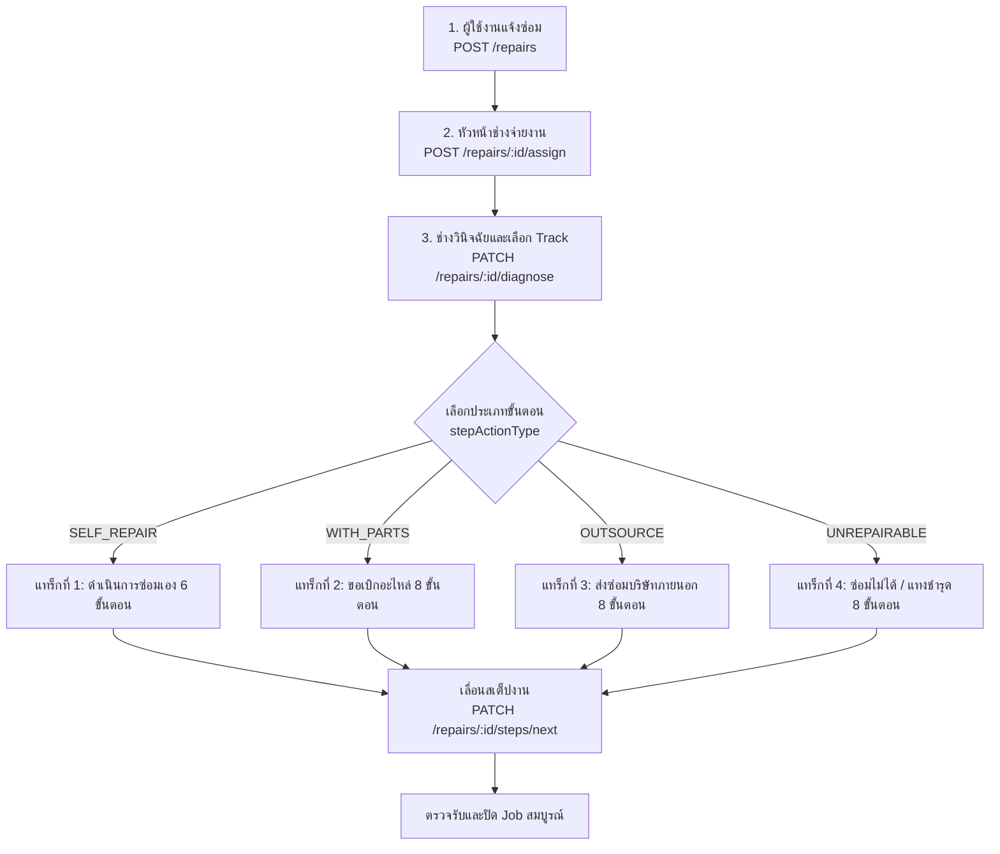

# คู่มือ Flow การทำงานและ API Request Body สำหรับระบบแจ้งซ่อมและส่งซ่อม

เอกสารนี้รวบรวม Flow การทำงาน, ขั้นตอนตามสถานะ (Tracks), สิทธิ์ผู้ใช้งาน (Roles), Endpoint และตัวอย่าง **Request Body (JSON)** ในแต่ละขั้นตอนของระบบงานแจ้งซ่อม

---

## 📌 ภาพรวมสิทธิ์และบทบาท (Roles)

| Role Code | คำอธิบาย |
| :--- | :--- |
| `DEPARTMENT_STAFF` | เจ้าหน้าที่ประจำแผนก/หน่วยงาน (ผู้แจ้งซ่อม / ผู้ตรวจรับเครื่องคืน) |
| `MAINTENANCE_HEAD` | หัวหน้างานซ่อมบำรุง (จ่ายงาน/Triage ให้ช่าง) |
| `MAINTENANCE_STAFF` | ช่างซ่อมบำรุง (ตรวจประเมิน/วินิจฉัย/ลงมือซ่อม/บันทึกผล) |
| `PARCEL_STAFF` | เจ้าหน้าที่พัสดุ (อนุมัติจัดหาอะไหล่ / ส่งซ่อมภายนอก / รับซากแทงชำรุด) |
| `MANAGER` / `ADMIN` | ผู้บริหาร / ผู้ดูแลระบบ (อนุมัติ/ดูภาพรวม) |

---

## 🔄 ภาพรวมลำดับขั้นตอนหลัก (Lifecycle Flow)



---

## 1. แจ้งซ่อมออนไลน์ (Create Repair Request)

* **Endpoint**: `POST /repairs`
* **ผู้มีสิทธิ์**: `DEPARTMENT_STAFF`, `MAINTENANCE_STAFF`, `MAINTENANCE_HEAD`, `ASSET_CENTER_STAFF`, `PARCEL_STAFF`, `MANAGER`, `ADMIN`
* **คำอธิบาย**: บันทึกคำขอแจ้งซ่อมเริ่มต้น ครุภัณฑ์จะถูกปรับสถานะเป็น `UNDER_REPAIR` และ `UNAVAILABLE` ทันที

### Request Body (JSON)
```json
{
  "assetId": "550e8400-e29b-41d4-a716-446655440000",
  "symptom": "เครื่องเปิดไม่ติด มีกลิ่นไหม้ที่ช่องระบายความร้อนด้านหลัง",
  "urgencyStatus": "URGENT",
  "reportType": "Repair"
}
```

### คำอธิบายฟิลด์:
* `assetId` *(UUID, จำเป็น)*: UUID ของครุภัณฑ์ที่ต้องการส่งซ่อม
* `symptom` *(string, จำเป็น)*: อาการเสีย/ปัญหาที่พบ
* `urgencyStatus` *(enum, จำเป็น)*: ระดับความเร่งด่วน ได้แก่ `"NORMAL"`, `"URGENT"`, `"EMERGENCY"`
* `reportType` *(enum, จำเป็น)*: ประเภทรายงาน ได้แก่ `"Repair"` (งานซ่อมทั่วไป), `"Maintenance"` (งานบำรุงรักษา)

---

## 2. หัวหน้าช่างจ่ายงาน (Triage & Dispatch Job)

* **Endpoint**: `POST /repairs/:id/assign`
* **ผู้มีสิทธิ์**: `MAINTENANCE_HEAD`
* **คำอธิบาย**: หัวหน้าช่างจำแนกหมวดหมู่งานซ่อมและมอบหมายช่างผู้รับผิดชอบ (อย่างน้อย 1 คน)

### Request Body (JSON)
```json
{
  "techCategoryId": 1,
  "mechanicIds": [
    "3fa85f64-5717-4562-b3fc-2c963f66afa6",
    "7c9e6679-7425-40de-944b-e07fc1f90ae7"
  ]
}
```

### คำอธิบายฟิลด์:
* `techCategoryId` *(number, จำเป็น)*: รหัสหมวดงานซ่อม เช่น 1 (`MED_EQ`: เครื่องมือแพทย์), 6 (`ELECTRICAL`: ไฟฟ้า), 7 (`IT_HW_SW`: คอมพิวเตอร์)
* `mechanicIds` *(array of UUID, จำเป็น)*: รายชื่อ UUID ของช่างซ่อมบำรุงที่ได้รับมอบหมาย

---

## 3. ช่างวินิจฉัยและเลือกแนวทางการซ่อม (Diagnosis & Plan)

* **Endpoint**: `PATCH /repairs/:id/diagnose`
* **ผู้มีสิทธิ์**: `MAINTENANCE_STAFF`, `MAINTENANCE_HEAD`
* **คำอธิบาย**: ช่างตรวจเช็คและเลือก 1 ใน 4 แทร็ก (`stepActionType`) เพื่อสร้างขั้นตอนปฏิบัติงานจริง

### 3.1 กรณีดำเนินการซ่อมเอง (`SELF_REPAIR`)
```json
{
  "diagnosis": "พาวเวอร์ซัพพลายสายหลวมและฝุ่นเกาะแน่น แผงวงจรปกติ",
  "solution": "ทำความสะอาดคอนแทกต์ เป่าฝุ่น และยึดขั้วสายไฟใหม่",
  "causeId": 4,
  "techCategoryId": 1,
  "jobTypeId": 1,
  "actionType": "REPAIR",
  "stepActionType": "SELF_REPAIR",
  "dueDate": "2026-09-15T17:00:00.000Z",
  "isRepeatRepair": false
}
```

### 3.2 กรณีขอเบิกอะไหล่ / ขอซื้อทดแทน (`WITH_PARTS`)
> สามารถระบุขอเบิกทั้งอะไหล่ในคลัง (`INTERNAL`) และสั่งซื้อภายนอก (`EXTERNAL`) ร่วมกันได้
```json
{
  "diagnosis": "เมนบอร์ดและพัดลมระบายความร้อนเสื่อมสภาพ",
  "solution": "เปลี่ยนพัดลมระบายความร้อนและฟิวส์",
  "causeId": 5,
  "techCategoryId": 1,
  "jobTypeId": 1,
  "actionType": "REPAIR",
  "stepActionType": "WITH_PARTS",
  "dueDate": "2026-09-20T17:00:00.000Z",
  "isRepeatRepair": false,
  "spareParts": [
    {
      "sparepartId": 1,
      "qty": 2,
      "stockType": "INTERNAL"
    },
    {
      "sparepartId": 3,
      "qty": 1,
      "stockType": "EXTERNAL"
    }
  ]
}
```

### 3.3 กรณีส่งซ่อมบริษัทภายนอก (`OUTSOURCE`)
```json
{
  "diagnosis": "หัวตรวจ Transducer อัลตราซาวด์มีความเสียหายภายใน ต้องใช้เครื่องมือเทียบเฉพาะทางของผู้ผลิต",
  "solution": "ส่งซ่อมและสอบเทียบกับศูนย์บริการตัวแทนจำหน่าย",
  "causeId": 18,
  "techCategoryId": 1,
  "jobTypeId": 1,
  "actionType": "REPAIR",
  "stepActionType": "OUTSOURCE",
  "dueDate": "2026-09-30T17:00:00.000Z",
  "isRepeatRepair": false
}
```

### 3.4 กรณีซ่อมไม่ได้ / แทงชำรุด (`UNREPAIRABLE`)
```json
{
  "diagnosis": "ชุดหลอดรังสีเอกซ์แตกร้าว ตัวเครื่องตกรุ่นไม่มีอะไหล่ผลิตแล้ว",
  "solution": "ไม่คุ้มค่าต่อการซ่อมแซม เสนอแทงชำรุดเพื่อจำหน่าย",
  "causeId": 17,
  "techCategoryId": 1,
  "jobTypeId": 1,
  "actionType": "REPAIR",
  "stepActionType": "UNREPAIRABLE",
  "dueDate": "2026-09-12T17:00:00.000Z",
  "isRepeatRepair": false,
  "unrepairableReason": "อะไหล่เลิกผลิต ค่าซ่อมประเมินเกิน 70% ของมูลค่าเครื่องปัจจุบัน เห็นควรแทงชำรุด"
}
```

---

## 4. การขยับขั้นตอนการทำงาน (Advance Steps)

* **Endpoint**: `PATCH /repairs/:id/steps/next`
* **ผู้มีสิทธิ์**: ขึ้นอยู่กับขั้นตอนและแทร็กงาน (ตามตารางขั้นตอนด้านล่าง)

### 4.1 สเต็ปทั่วไป (บันทึกหมายเหตุ)
```json
{
  "note": "ส่งเรื่องขออนุมัติเรียบร้อย"
}
```

### 4.2 เฉพาะกรณี `OUTSOURCE` สเต็ป 5 (พัสดุเลือกบริษัท พร้อมบันทึกบิลและตกลงค่าซ่อม)
* **ผู้มีสิทธิ์**: `PARCEL_STAFF`
```json
{
  "companyId": "e305ff64-9844-42b7-8db2-2df20ecf3299",
  "billNo": "INV-2026-9901",
  "repairCost": 8500.00,
  "note": "ส่งมอบเครื่องให้บริษัทรับไปดำเนินการซ่อมตามใบเสนอราคา"
}
```

### 4.3 เฉพาะกรณี `OUTSOURCE` สเต็ป 6 (ช่างรับเครื่องกลับและทดสอบการทำงาน)
* **ผู้มีสิทธิ์**: `MAINTENANCE_STAFF`, `MAINTENANCE_HEAD`
```json
{
  "note": "รับเครื่องกลับและทดสอบฟังก์ชันการทำงานหลังซ่อม ใช้งานได้ปกติ"
}
```

### 4.4 สเต็ปสุดท้ายของทุกแทร็ก (ตรวจรับงาน, วันรับประกัน, และปิด Job)
* **ผู้มีสิทธิ์**: `MAINTENANCE_STAFF`, `MAINTENANCE_HEAD` (ส่งมอบให้เจ้าหน้าที่หน่วยงานตรวจรับ)
* **ข้อกำหนด**: `receiverId` และ `warrantyDate` เป็นฟิลด์บังคับในสเต็ปสุดท้าย (ผู้ตรวจรับต้องเป็นผู้แจ้งเดิม หรือสังกัดแผนกเดียวกัน)
```json
{
  "receiverId": "9b1deb4d-3b7d-4bad-9bdd-2b0d7b3dcb6d",
  "warrantyDate": "2027-09-10",
  "note": "ส่งมอบเครื่องคืนหน่วยงาน OPD เรียบร้อย ทดสอบต่อหน้าผู้ใช้งาน"
}
```

---

## 5. ตารางขั้นตอนในแต่ละแทร็ก (Step Master Checklist)

### 🔹 แทร็กที่ 1: ดำเนินการซ่อมเอง (`SELF_REPAIR` - รวม 6 สเต็ป)
| สเต็ป | ชื่อขั้นตอน | ผู้ดำเนินการ | หมายเหตุ Request Body |
| :---: | :--- | :--- | :--- |
| 1 | วันแจ้งซ่อม | ระบบ (อัตโนมัติ) | - |
| 2 | หัวหน้าช่าง Triage & จ่ายงาน | `MAINTENANCE_HEAD` | บันทึกผ่าน `/assign` |
| 3 | ช่างตรวจเช็ค & วินิจฉัย | `MAINTENANCE_STAFF` | บันทึกผ่าน `/diagnose` |
| 4 | ซ่อมเองและทดสอบ | `MAINTENANCE_STAFF` | `{ "note": "..." }` |
| 5 | แล้วเสร็จ / รอส่งมอบ | `MAINTENANCE_STAFF` | `{ "note": "..." }` |
| 6 | ตรวจรับและปิด Job | `MAINTENANCE_STAFF` | **ต้องส่ง** `receiverId`, `warrantyDate` |

---

### 🔹 แทร็กที่ 2: ขอเบิกอะไหล่ / ซื้อทดแทน (`WITH_PARTS` - รวม 8 สเต็ป)
| สเต็ป | ชื่อขั้นตอน | ผู้ดำเนินการ | หมายเหตุ Request Body |
| :---: | :--- | :--- | :--- |
| 1-3 | แจ้งซ่อม -> จ่ายงาน -> วินิจฉัย | ช่าง / หัวหน้าช่าง | เลือก `spareParts` ใน `/diagnose` |
| 4 | ขอเบิกอะไหล่ (ผสม In/Out) | ระบบ Auto-complete | ระบบสร้างรายการตัดคลังอัตโนมัติ |
| 5 | พัสดุจ่ายของ/สั่งซื้อภายนอก | `PARCEL_STAFF` | `{ "note": "สั่งซื้อจากภายนอกเรียบร้อย" }` |
| 6 | ช่างรับอะไหล่ & ลงมือซ่อม | `MAINTENANCE_STAFF` | `{ "note": "รับอะไหล่เรียบร้อย" }` |
| 7 | แล้วเสร็จ / รอส่งมอบ | `MAINTENANCE_STAFF` | `{ "note": "..." }` |
| 8 | ตรวจรับและปิด Job | `MAINTENANCE_STAFF` | **ต้องส่ง** `receiverId`, `warrantyDate` |

---

### 🔹 แทร็กที่ 3: ส่งซ่อมบริษัทภายนอก (`OUTSOURCE` - รวม 8 สเต็ป)
| สเต็ป | ชื่อขั้นตอน | ผู้ดำเนินการ | หมายเหตุ Request Body |
| :---: | :--- | :--- | :--- |
| 1-3 | แจ้งซ่อม -> จ่ายงาน -> วินิจฉัย | ช่าง / หัวหน้าช่าง | เลือก `OUTSOURCE` ใน `/diagnose` |
| 4 | ขอส่งซ่อมภายนอก (พัสดุจัดจ้าง) | ระบบ Auto-complete | อนุมัติการส่งซ่อมภายนอก |
| 5 | พัสดุส่งบริษัทภายนอกซ่อม | `PARCEL_STAFF` | **ระบุ** `companyId`, `billNo`, `repairCost` |
| 6 | รับเครื่องคืนและทดสอบ | `MAINTENANCE_STAFF` | `{ "note": "ผลการทดสอบเครื่อง" }` |
| 7 | แล้วเสร็จ / รอส่งมอบ | `MAINTENANCE_STAFF` | `{ "note": "..." }` |
| 8 | ตรวจรับและปิด Job | `MAINTENANCE_STAFF` | **ต้องส่ง** `receiverId`, `warrantyDate` |

---

### 🔹 แทร็กที่ 4: ซ่อมไม่ได้ / แทงชำรุด (`UNREPAIRABLE` - รวม 8 สเต็ป)
| สเต็ป | ชื่อขั้นตอน | ผู้ดำเนินการ | หมายเหตุ Request Body |
| :---: | :--- | :--- | :--- |
| 1-3 | แจ้งซ่อม -> จ่ายงาน -> วินิจฉัย | ช่าง / หัวหน้าช่าง | ระบุ `unrepairableReason` |
| 4 | ยื่นเรื่องแทงชำรุด | ระบบ Auto-complete | สถานะ Job เป็น `UNREPAIRABLE` |
| 5 | ช่างนำส่งเครื่องที่ห้องพัสดุ | `MAINTENANCE_STAFF` | `{ "note": "นำส่งพัสดุเรียบร้อย" }` |
| 6-8 | พัสดุกดยืนยันรับมอบเครื่อง | `PARCEL_STAFF` | ใช้ Endpoint พิเศษ (ดูหัวข้อ 6.2) |

---

## 6. กรณีพิเศษอื่น ๆ (Special Actions)

### 6.1 ไม่อนุมัติ / ตีกลับขั้นตอน (Reject Step)
* **Endpoint**: `PATCH /repairs/:id/steps/reject`
* **ผู้มีสิทธิ์**: `PARCEL_STAFF`, `MANAGER`
* **คำอธิบาย**: ตีกลับเพื่อให้ช่างทำการวินิจฉัยและวางแผนใหม่ (`PENDING_ASSIGN`)
```json
{
  "reason": "งบประมาณซ่อมสูงเกินความจำเป็น แนะนำให้ส่งซ่อมแบบซ่อมเองหรือขอซื้อทดแทน"
}
```

### 6.2 พัสดุกดยืนยันรับซากเครื่องชำรุด (Complete Unrepairable Handover)
* **Endpoint**: `PATCH /repairs/:id/complete-unrepairable`
* **ผู้มีสิทธิ์**: `PARCEL_STAFF`, `MANAGER`
* **คำอธิบาย**: พัสดุรับเครื่องเข้าคลังพักรอจำหน่าย และปรับสถานะครุภัณฑ์เป็น `WAIT_DISPOSAL`
```json
{
  "storageLocation": "ห้องพักพัสดุชำรุด อาคารพัสดุกลาง ชั้น 1",
  "note": "รับมอบเครื่องพร้อมอุปกรณ์ต่อพ่วงครบถ้วน เตรียมตั้งกรรมการแทงจำหน่าย"
}
```

### 6.3 ยกเลิกใบแจ้งซ่อม (Cancel Job)
* **Endpoint**: `PATCH /repairs/:id/cancel`
* **ผู้มีสิทธิ์**: `MAINTENANCE_STAFF`, `MAINTENANCE_HEAD`
* **เงื่อนไข**: สามารถยกเลิกได้เฉพาะก่อนที่งานจะผ่านขั้นตอนการอนุมัติ
```json
{
  "reason": "ผู้ใช้งานแจ้งซ่อมผิดเครื่อง / เครื่องไม่ได้เสียจริง (ปลั๊กไฟหลุด)"
}
```

### 6.4 คืนอะไหล่เหลือใช้เข้าคลัง (Return Spare Parts)
* **Endpoint**: `POST /repairs/:id/spare-parts/return`
* **ผู้มีสิทธิ์**: `PARCEL_STAFF`
```json
{
  "sparepartId": 1,
  "qty": 1
}
```
